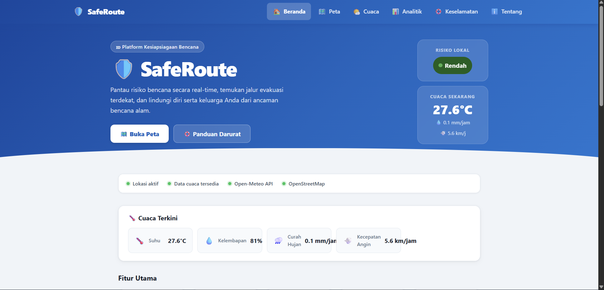
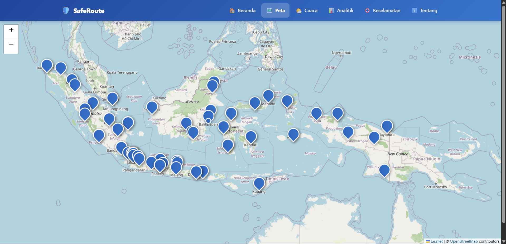
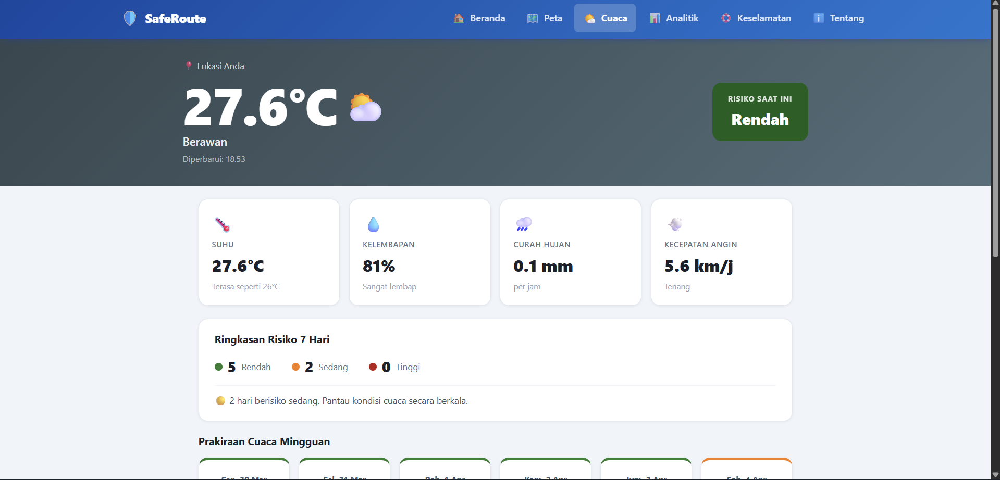
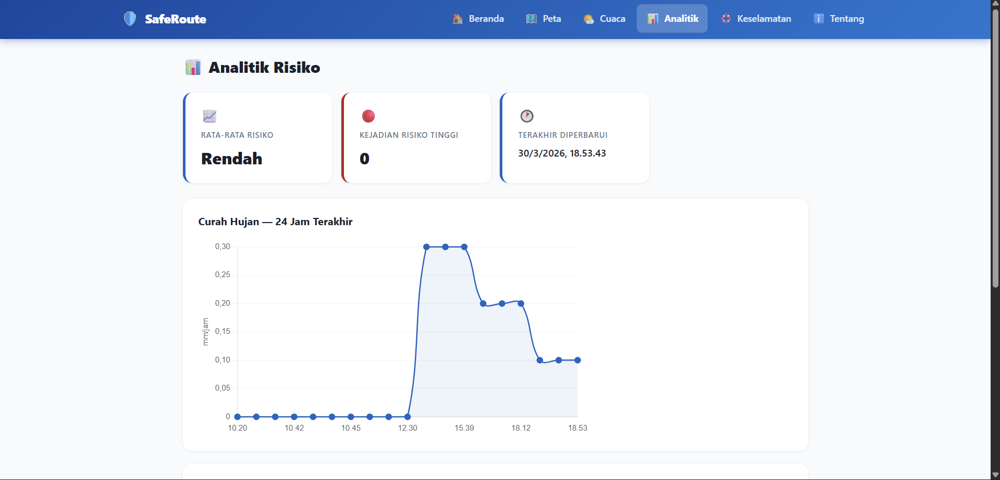
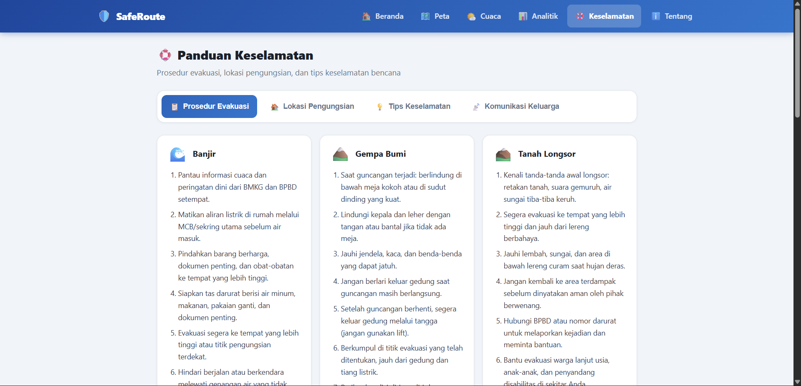
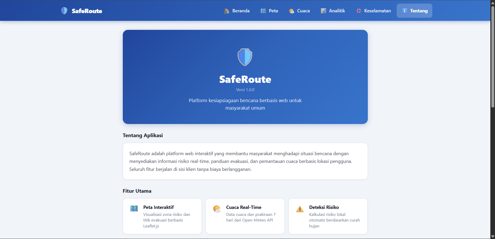

# 🛡️ SafeRoute

<div align="center">


**Platform web kesiapsiagaan bencana real-time untuk masyarakat Indonesia**

</div>

---

## 📋 Deskripsi Proyek

**SafeRoute** adalah platform web interaktif berbasis Vue.js 3 yang membantu masyarakat umum menghadapi situasi bencana alam. Sistem ini menyediakan visualisasi zona aman dan rawan bencana, panduan jalur evakuasi tercepat, pemantauan cuaca dan risiko lokal secara real-time, serta notifikasi darurat otomatis melalui browser.

Proyek ini hadir untuk menjawab kebutuhan nyata masyarakat Indonesia yang tinggal di wilayah rawan bencana dengan memberikan informasi risiko yang mudah dipahami, jalur evakuasi yang jelas, dan panduan keselamatan yang komprehensif, semuanya langsung di browser tanpa instalasi tambahan dan 100% gratis.

---

## 📑 Daftar Isi

- [Demo](#-demo)
- [Tampilan Aplikasi](#-tampilan-aplikasi)
- [Latar Belakang](#-latar-belakang)
- [Fitur Utama](#-fitur-utama)
- [Teknologi yang Digunakan](#-teknologi-yang-digunakan)
- [Arsitektur](#-arsitektur)
- [Struktur Proyek](#-struktur-proyek)
- [Cara Penggunaan](#-cara-penggunaan)
- [Peran Developer](#-peran-developer)
- [Pembelajaran dari Proyek](#-pembelajaran-dari-proyek-lessons-learned)
- [Ucapan Terima Kasih](#-ucapan-terima-kasih)

---

## 🎮 Demo

> Coming Soon

---

## 📸 Tampilan Aplikasi

### Halaman Beranda




### Halaman Peta Interaktif




### Halaman Prakiraan Cuaca




### Halaman Analitik Risiko




### Halaman Panduan Keselamatan




### Halaman Tentang Aplikasi




---

## 🎯 Latar Belakang

Indonesia adalah salah satu negara paling rawan bencana di dunia. Berada di Cincin Api Pasifik, memiliki lebih dari 127 gunung berapi aktif, dan menghadapi ancaman banjir, tsunami, gempa bumi, serta cuaca ekstrem setiap tahunnya.

Kebutuhan yang melatarbelakangi proyek ini:

- **Kurangnya akses informasi risiko yang mudah dipahami** karena banyak sistem peringatan dini yang terlalu teknis dan sulit diakses masyarakat umum
- **Minimnya panduan evakuasi berbasis lokasi** untuk masyarakat sering tidak tahu harus ke mana saat bencana terjadi
- **Kebutuhan akan sistem real-time** saat kondisi cuaca berubah cepat, dibutuhkan analisis risiko yang selalu diperbarui
- **Pentingnya edukasi kebencanaan terpusat** untuk informasi prosedur evakuasi tersebar di berbagai sumber yang tidak terstruktur
- **Aksesibilitas tanpa instalasi** dari aplikasi berbasis browser memungkinkan siapa saja mengakses tanpa mengunduh aplikasi

---

## 🌟 Fitur Utama

### 🗺️ Peta Interaktif Zona Risiko
| Fitur | Deskripsi |
|-------|-----------|
| Visualisasi zona | Polygon GeoJSON berwarna sesuai tingkat risiko (hijau/kuning/merah) |
| Popup informatif | Klik zona untuk melihat nama, tingkat risiko, dan deskripsi bahaya |
| Marker evakuasi | Titik pengungsian yang dapat diklik untuk info lokasi |
| Routing evakuasi | Kalkulasi rute dari lokasi pengguna ke titik evakuasi terdekat |
| Lokasi pengguna | Marker "you are here" otomatis mengikuti GPS pengguna |

### 🌤️ Pemantauan Cuaca Real-time
| Fitur | Deskripsi |
|-------|-----------|
| Cuaca terkini | Suhu, kelembapan, curah hujan, kecepatan angin |
| Prakiraan mingguan | 7 hari ke depan dengan ikon cuaca dan prediksi risiko |
| Feels-like | Estimasi suhu yang dirasakan berdasarkan kelembapan |
| Tips dinamis | Saran aktivitas berdasarkan kondisi cuaca aktual |
| Auto-retry | Percobaan ulang otomatis setelah 60 detik jika API gagal |

### ⚠️ Deteksi Risiko Lokal
| Level | Kondisi |
|-------|---------|
| 🟢 Rendah | Curah hujan < 10 mm/jam |
| 🟡 Sedang | Curah hujan 10–30 mm/jam |
| 🔴 Tinggi | Curah hujan > 30 mm/jam |

### 🔔 Notifikasi Darurat
- Push notification browser otomatis saat risiko berubah ke **Tinggi**
- Banner peringatan in-app terlepas dari status izin notifikasi
- Pencegahan notifikasi duplikat dalam rentang < 10 menit
- Polling pembaruan cuaca setiap 5 menit saat risiko tinggi

### 📊 Analitik Risiko
- Line chart curah hujan 24 jam terakhir
- Bar chart distribusi tingkat risiko historis
- Statistik: rata-rata risiko, kejadian risiko tinggi, waktu terakhir diperbarui
- Data tersimpan di localStorage tanpa memerlukan backend

### 🛟 Panduan Keselamatan
- Prosedur evakuasi untuk 8 jenis bencana (Banjir, Gempa, Tsunami, Kebakaran, Gunung Berapi, Longsor, Puting Beliung, Kekeringan)
- 80+ lokasi pengungsian resmi di seluruh 38 provinsi Indonesia
- Filter lokasi pengungsian per provinsi
- Tips keselamatan: tas darurat, nomor darurat, komunikasi keluarga

---

## 🛠️ Teknologi yang Digunakan

### Core Technologies
| Teknologi | Versi | Fungsi |
|-----------|-------|--------|
| **Vue.js 3** | 3.5 | Framework UI dengan Composition API |
| **Vite** | 8.0 | Build tool dan dev server modern |
| **Pinia** | 3.0 | State management ringan untuk Vue |
| **Vue Router** | 5.0 | Client-side routing antar halaman |

### UI & Visualisasi
| Library | Versi | Fungsi |
|---------|-------|--------|
| **Leaflet.js** | 1.9 | Peta interaktif berbasis OpenStreetMap |
| **Leaflet Routing Machine** | 3.2 | Kalkulasi rute evakuasi |
| **Chart.js** | 4.5 | Grafik analitik risiko dan curah hujan |

### External APIs
| API | Fungsi |
|-----|--------|
| **Open-Meteo** | Data cuaca real-time gratis tanpa API key |
| **OpenStreetMap** | Tile peta dunia open-source |
| **OSRM (via LRM)** | Kalkulasi rute evakuasi gratis |
| **Browser Geolocation API** | Deteksi lokasi pengguna |
| **Browser Notification API** | Push notification darurat |

### Testing
| Library | Versi | Fungsi |
|---------|-------|--------|
| **Vitest** | 4.1 | Test runner berbasis Vite |
| **@vue/test-utils** | 2.4 | Testing komponen Vue |
| **fast-check** | 4.6 | Property-based testing |
| **jsdom** | 29.0 | Simulasi DOM untuk testing |

---

## 🏗️ Arsitektur

SafeRoute menggunakan arsitektur **Single Page Application (SPA)** berbasis Vue.js 3 dengan Composition API. Semua logika berjalan di sisi klien tanpa backend server.

---

## 📁 Struktur Proyek

```
saferoute/
│
├── index.html                    # Entry point HTML
├── package.json                  # Dependensi dan skrip npm
├── vite.config.js                # Konfigurasi Vite + Vitest
│
├── Screenshot/                   # Tampilan aplikasi
│
└── src/
    ├── main.js                   # Entry point Vue
    ├── App.vue                   # Root komponen + bootstrap data
    ├── style.css                 # CSS global
    │
    ├── router/
    │   └── index.js              # Konfigurasi Vue Router (9 rute)
    │
    ├── stores/
    │   ├── locationStore.js      # State koordinat & izin lokasi
    │   ├── weatherStore.js       # State cuaca & prakiraan
    │   ├── riskStore.js          # State risiko, histori, polling
    │   └── routeStore.js         # State rute evakuasi aktif
    │
    ├── composables/
    │   ├── useGeolocation.js     # Geolocation API wrapper
    │   ├── useWeather.js         # Fetch Open-Meteo + retry logic
    │   └── useRiskCalculator.js  # Rule-based risk engine
    │
    ├── utils/
    │   ├── mapUtils.js           # Style zona & popup GeoJSON
    │   ├── weatherUtils.js       # Proses prakiraan & ikon cuaca
    │   ├── analyticsUtils.js     # Kalkulasi statistik risiko
    │   ├── accessibilityUtils.js # Kalkulasi kontras warna WCAG
    │   ├── NotificationHandler.js# Browser Notification API
    │   └── __tests__/            # Unit & property tests
    │
    ├── views/
    │   ├── Home.vue              # Beranda dengan status & quick links
    │   ├── MapView.vue           # Peta interaktif Leaflet
    │   ├── WeatherForecast.vue   # Prakiraan cuaca mingguan
    │   ├── Analytics.vue         # Grafik analitik risiko
    │   ├── EvacuationRoute.vue   # Detail rute evakuasi
    │   ├── RiskStatus.vue        # Status risiko terkini
    │   ├── Safety.vue            # Panduan keselamatan (tab)
    │   ├── About.vue             # Tentang aplikasi
    │   └── NotFound.vue          # Halaman 404
    │
    ├── components/
    │   ├── NavBar.vue            # Navigasi utama + mobile menu
    │   ├── AppFooter.vue         # Footer hak cipta
    │   ├── RiskBadge.vue         # Badge level risiko berwarna
    │   ├── WeatherPanel.vue      # Panel cuaca terkini
    │   ├── EmergencyBanner.vue   # Banner darurat saat risiko tinggi
    │   └── EvacuationMarker.vue  # Marker titik evakuasi di peta
    │
    └── data/
        ├── zonaRisiko.json       # GeoJSON zona risiko 24 kota
        ├── evacuationPoints.js   # 80+ titik evakuasi 38 provinsi
        └── evacuationProcedures.js # Prosedur 8 jenis bencana
```

---

## 🎮 Cara Penggunaan

### 1. Pertama Kali Membuka Aplikasi
Saat pertama kali membuka, browser akan meminta izin akses lokasi. Klik **Izinkan** untuk deteksi GPS otomatis. Aplikasi akan langsung mengambil data cuaca dan menghitung tingkat risiko di lokasi Anda.

### 2. Beranda
- Lihat **status risiko lokal** dan **data cuaca terkini** di hero section
- Pantau **status sistem** (lokasi aktif, data cuaca tersedia)
- Akses cepat ke semua fitur melalui kartu **Fitur Utama**
- Lihat **nomor darurat** yang bisa langsung ditekan untuk menelepon

### 3. Peta Interaktif
- Peta otomatis berpindah ke **lokasi Anda** saat GPS tersedia
- Klik **polygon zona risiko** untuk melihat detail bahaya di area tersebut
- Klik **marker biru** (titik evakuasi) untuk melihat info dan menghitung rute
- Jika lokasi tidak tersedia, klik peta untuk **menentukan titik awal manual**

### 4. Prakiraan Cuaca
- Lihat **cuaca terkini** dengan suhu, kelembapan, curah hujan, dan angin
- Pantau **prakiraan cuaca mingguan** beserta prediksi risiko tiap hari
- Baca **tips hari ini** yang disesuaikan dengan kondisi cuaca aktual

### 5. Analitik Risiko
- Pantau **grafik curah hujan** 24 jam terakhir di lokasi Anda
- Lihat **distribusi tingkat risiko** dari data historis yang tersimpan

### 6. Panduan Keselamatan
- Pilih tab **Prosedur Evakuasi** untuk panduan langkah demi langkah per jenis bencana
- Gunakan tab **Lokasi Pengungsian** dan filter per provinsi untuk menemukan shelter terdekat
- Pelajari **Tips Keselamatan** dan **Komunikasi Keluarga** untuk persiapan darurat

---

## 👨‍💻 Peran Developer

Proyek ini dikembangkan secara mandiri sebagai proyek portofolio untuk mendemonstrasikan kemampuan pengembangan aplikasi web modern dengan Vue.js 3.

| Area | Kontribusi |
|------|------------|
| **Arsitektur** | Merancang alur data dari lokasi → cuaca → risiko → notifikasi → persistensi |
| **UI/UX** | Desain antarmuka responsif dengan tema biru konsisten dan aksesibilitas WCAG |
| **Peta Interaktif** | Integrasi Leaflet dengan GeoJSON, marker dinamis, routing, dan "you are here" |
| **Mesin Risiko** | Rule-based risk engine berdasarkan threshold curah hujan |
| **State Management** | Implementasi Pinia stores dengan reactive watchers dan localStorage |
| **Notifikasi** | Browser Notification API dengan pencegahan duplikat dan polling otomatis |
| **Analitik** | Chart.js line chart dan bar chart dengan data dari localStorage |
| **Panduan Keselamatan** | Data 80+ titik evakuasi 38 provinsi dan 8 prosedur bencana |
| **Testing** | 34 unit test dan property-based test dengan fast-check (18 properties) |

---

## 📚 Pembelajaran dari Proyek (Lessons Learned)

### 1. Vue.js 3 Composition API

```javascript
// Composable yang reusable dan testable
export function useRiskCalculator() {
  const riskLevel = ref(null)
  const riskColor = ref(null)

  function calculateRisk(weatherData) {
    const { precipitation } = weatherData
    if (precipitation < 10) return 'Rendah'
    if (precipitation <= 30) return 'Sedang'
    return 'Tinggi'
  }

  return { riskLevel, riskColor, calculateRisk }
}
```

### 2. Pinia untuk State Management Reaktif

```javascript
// Watch antar store untuk alur data otomatis
watch(() => weatherStore.currentWeather, (weather) => {
  if (weather) riskStore.setRisk(computeRisk(weather))
})
```

### 3. Leaflet dengan ES Module (UMD workaround)

```javascript
// leaflet-routing-machine butuh L sebagai global
import L from 'leaflet'
if (typeof window !== 'undefined') window.L = L
import 'leaflet-routing-machine'
```

### 4. Property-Based Testing dengan fast-check

```javascript
// Menguji properti yang harus berlaku untuk semua input valid
test('kalkulasi risiko sesuai threshold', () => {
  fc.assert(
    fc.property(fc.float({ min: 0, max: 200 }), (precipitation) => {
      const result = calculateRisk({ precipitation })
      if (precipitation < 10) return result === 'Rendah'
      if (precipitation <= 30) return result === 'Sedang'
      return result === 'Tinggi'
    }),
    { numRuns: 100 }
  )
})
```

### 5. Leaflet `invalidateSize` untuk Rendering yang Benar

```javascript
// Peta terpotong jika container belum punya dimensi final
nextTick(() => { mapInstance.invalidateSize() })
setTimeout(() => { mapInstance.invalidateSize() }, 300)
```

### 6. localStorage Round-trip untuk Persistensi

```javascript
// Simpan dan baca data historis tanpa backend
function saveRecord(record) {
  history.value.push(record)
  localStorage.setItem(STORAGE_KEY, JSON.stringify(history.value))
}
```

---

## 🙏 Ucapan Terima Kasih

### API & Data
- [**Open-Meteo**](https://open-meteo.com/) — API cuaca real-time gratis dan open-source tanpa API key
- [**OpenStreetMap**](https://www.openstreetmap.org/) — Tile peta dunia berbasis komunitas
- [**OSRM**](https://project-osrm.org/) — Kalkulasi rute evakuasi gratis via Leaflet Routing Machine
- [**BMKG**](https://www.bmkg.go.id/) — Referensi standar peringatan cuaca Indonesia
- [**BNPB**](https://www.bnpb.go.id/) — Referensi informasi dan prosedur kebencanaan Indonesia

### Library & Tools
- [**Vue.js**](https://vuejs.org/) — Framework UI yang powerful dengan ekosistem lengkap
- [**Pinia**](https://pinia.vuejs.org/) — State management yang simpel dan efisien
- [**Leaflet.js**](https://leafletjs.com/) — Library peta open-source yang ringan
- [**Chart.js**](https://www.chartjs.org/) — Visualisasi grafik yang fleksibel
- [**Vite**](https://vitejs.dev/) — Build tool modern yang sangat cepat
- [**Vitest**](https://vitest.dev/) — Test runner yang terintegrasi sempurna dengan Vite
- [**fast-check**](https://fast-check.io/) — Property-based testing yang powerful
- [**Shields.io**](https://shields.io/) — Badge untuk README

### Dokumentasi Referensi
- [MDN Web Docs](https://developer.mozilla.org/) — Referensi Web API (Geolocation, Notifications, localStorage)
- [WMO Weather Codes](https://open-meteo.com/en/docs) — Standar kode cuaca internasional

---

<div align="center">

**⭐ Jika proyek ini bermanfaat, jangan lupa beri bintang! ⭐**

*"Kesiapsiagaan bukan soal takut pada bencana, tapi soal siap menghadapinya."*

</div>
